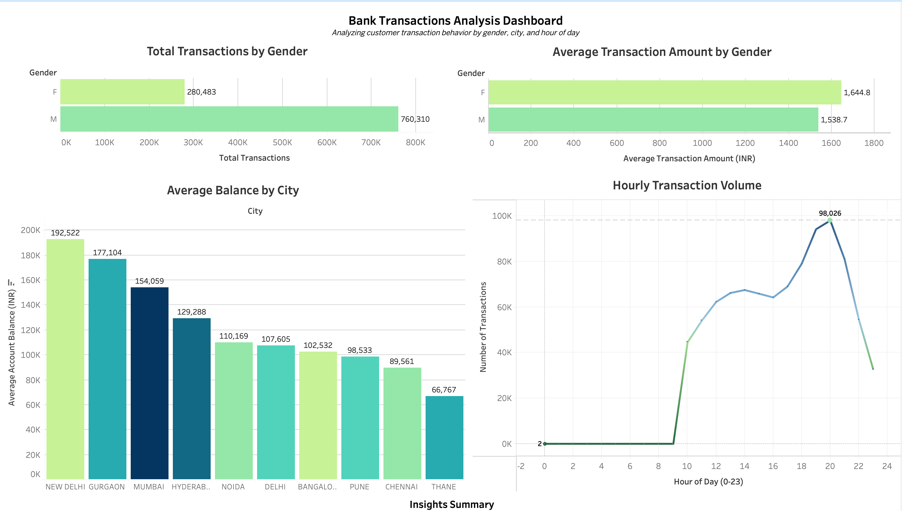

# ETL Pipeline for Bank Transactions

An end-to-end ETL (Extract, Transform, Load) pipeline built using Python, Pandas, and PostgreSQL.  
The project demonstrates how to clean, validate, and load large datasets into a relational database and prepare the data for analysis in Power BI.

## Overview
The dataset contains over one million banking transactions.  
The pipeline performs data extraction from a CSV file, transformation through cleaning and validation, and loading into a PostgreSQL database.  
Each run is logged with a timestamp and the number of rows processed.

[View the Tableau Dashboard on Tableau Public](https://public.tableau.com/views/BankingTransactionsDashboard/Dashboard1?:language=en-US&:sid=&:redirect=auth&:display_count=n&:origin=viz_share_link)

## Process
- Extracts transaction data from a CSV file.
- Cleans and standardizes columns and formats.
- Removes duplicates, missing values, and invalid records.
- Converts date fields into a consistent format.
- Loads the validated data into a PostgreSQL database.
- Records each ETL run in a log file with row count and status.

## Tools and Technologies
- Python, SQL
- Pandas, SQLAlchemy, Psycopg2
- PostgreSQL (local setup)
- Power BI for visualization

## How to Run
1. Clone this repository  
   git clone https://github.com/khshiptl/etl-pipeline-bank-transactions.git  
   cd etl-pipeline-bank-transactions  

2. Create a virtual environment and install dependencies  
   python3 -m venv .venv  
   source .venv/bin/activate  
   pip install pandas sqlalchemy psycopg2-binary python-dotenv  

3. Run the pipeline  
   python3 etl_pipeline.py  

4. View the log file  
   Each ETL run is recorded in `etl_log.txt` with the timestamp and total rows loaded.

## Key Learning Areas
- Building and automating an ETL pipeline
- Integrating Python with SQL databases
- Applying data cleaning and governance practices
- Preparing structured data for business intelligence tools

